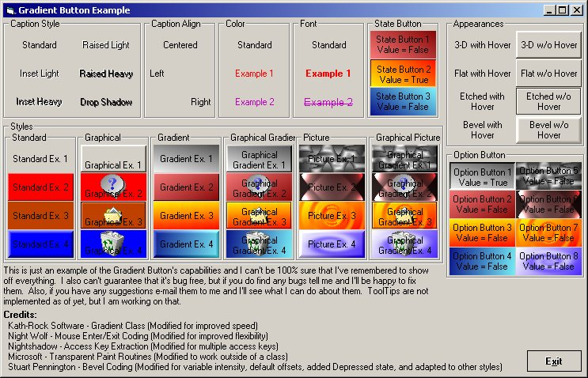



## Gradient Button v1\.2\.1

### Description

This button was created to be an enhanced replacement for Visual Basic's standard command button by adding 2 more Border appearance schemes, 2 more button styles, hover effects, 5 more caption styles, and state button compatibility. I cannot guarantee that this code is bug free although I have made every attempt to make it such. If you have any problems with this code please contact me and I'll do what I can to help you though the problem.

  

Release 1.1.0: 

+ New 

- 5 Caption Styles 

- State Button Capability (sort of like a checkbox) 

+ Fixed 

- Bug in caption wrapping that would lose a character if a single "word" was longer than the caption width. 

+ Improved 

- Slight speed increase from de-coupling the caption wrapping and drawing. 

 

Release 1.1.1: 

+ Fixed 

- Bug that would not re-process the caption for display if the caption was changed in code at run time, unless a refresh was done. (Bug introduced in Release 1.1.0) 

 

Release 1.2.0: 

+ New 

- Added Picture and Graphical Picture modes 

- Added Bevel Appearance Type 

- Added Bevel Width and Intensity properties (for customizing the bevel border) 

- Added UseClassicBorders property (to allow switching between blending and classic borders) 

- Added Option Button Compatibility and changed the structure of the State Button compatibility some 

+ Improved 

- Borders have been revamped to allow blending with the gradient/picture on the button 

+ Fixed 

- Fixed a minor issue with the ValueChanged event (event would not fire if changed via code) 

- Rewrote description text for properties / events / methods to be completely accurate 

 

Release 1.2.1: 

+ Fixed 

- ToolTips are finally fixed and working. (I thought this important enough for another release just for this one issue)
 
### More Info
 

             |
---                |---
**Submitted On**   |2001-02-15 19:41:30
**By**             |[Stephen Kent](https://github.com/Planet-Source-Code/PSCIndex/blob/master/ByAuthor/stephen-kent.md)
**Level**          |Intermediate
**User Rating**    |4.6 (73 globes from 16 users)
**Compatibility**  |VB 6\.0
**Category**       |[Custom Controls/ Forms/  Menus](https://github.com/Planet-Source-Code/PSCIndex/blob/master/ByCategory/custom-controls-forms-menus__1-4.md)
**World**          |[Visual Basic](https://github.com/Planet-Source-Code/PSCIndex/blob/master/ByWorld/visual-basic.md)
**Archive File**   |[CODE\_UPLOAD150292152001\.zip](https://github.com/Planet-Source-Code/stephen-kent-gradient-button-v1-2-1__1-14902/archive/master.zip)

